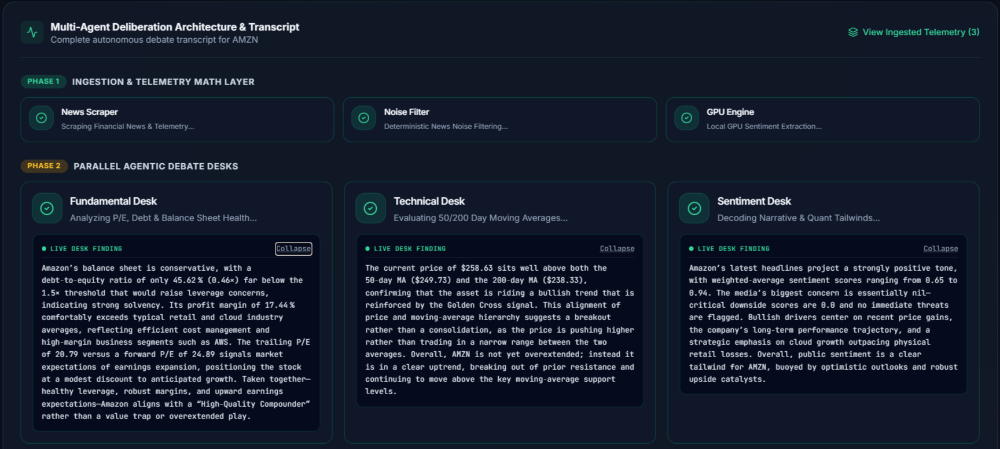
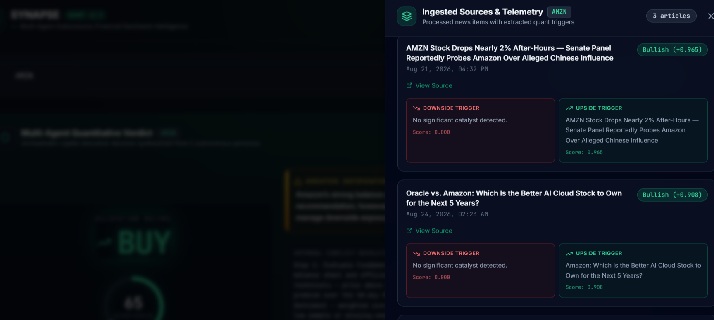
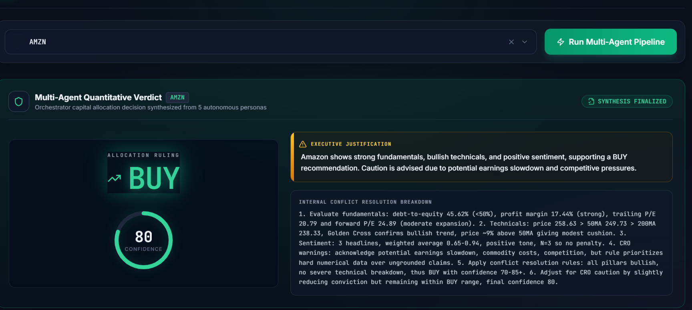
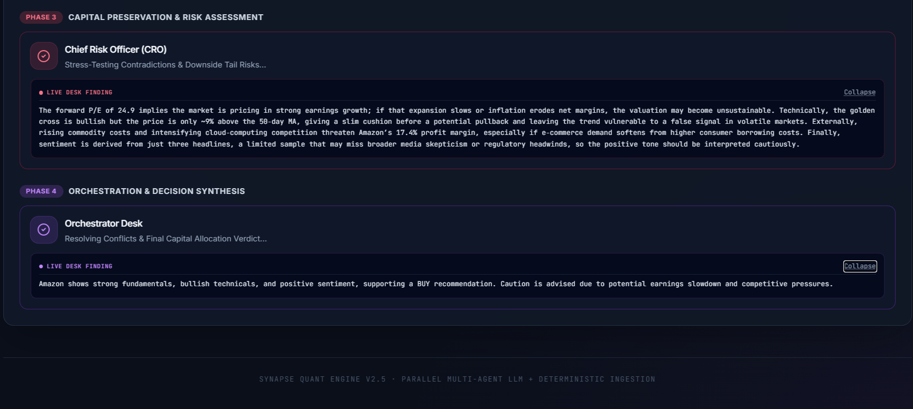

# ⚡ Synapse: Autonomous Quantitative Intelligence

An AI-driven, orchestrated pipeline for scraping, filtering, and analyzing real-time financial market sentiment.

🚀 **[View Live Demo](https://ai-liart-theta.vercel.app/)**

> **Note:** The backend runs on a serverless free tier. If inactive for more than 15 minutes, the initial request may take ~30–45 seconds to wake up the service.

---

## 🏗️ Architecture & Workflow


## 💻 Tech Stack
* **Frontend:** React, TypeScript, Vite, Tailwind CSS (Hosted on Vercel)
* **Backend:** Python, FastAPI, Uvicorn (Hosted on Render)
* **Multi-Agent Orchestration:** Google Gemini, Groq, Custom Python Orchestrator
* **AI & Sentiment Inference:** Fine-tuned Financial LLM (Hugging Face Serverless Inference API / Local PyTorch fallback)

## ✨ Key Features
* **Automated Data Pipeline:** Dedicated agents for scraping (`scraper.py`) and filtering (`filter_agent.py`) noisy financial data.
* **Intelligent Aggregation:** Compiles diverse news and market data streams into cohesive analytical contexts (`aggregator.py`).
* **Hybrid Sentiment Inference:** Ultra-lightweight cloud inference via Hugging Face Serverless with zero heavy PyTorch dependencies.
* **Multi-Agent Risk Debate:** Parallel agent deliberation and CRO risk assessment prior to final quantitative verdict.
* **Real-Time Visualization:** Interactive dashboard with confidence rings, stream logs, and verdict breakdowns.

## 📊 Dashboard Preview

<p align="center">
  
  
</p>

<p align="center">
  
  
</p>

---

## 📋 Prerequisites
* Python 3.9+
* Node.js v18+
* API Keys: Groq, Google Gemini, and Hugging Face Token

---
## ☁️ Cloud Architecture
* **Frontend (Vercel):** Single-page application configured with automated CI/CD and cold-start fallback handling.
* **Backend (Render):** Lightweight FastAPI server running in zero-PyTorch serverless adapter mode.
* **Model Inference (Hugging Face):** Offloaded to Hugging Face Serverless Inference to eliminate heavy GPU/RAM overhead on the backend.
## 🚀 Quick Start

### 1. Backend Setup
```bash
cd fin_sentience_model/backend

# Create & activate virtual environment
python -m venv venv

# on Windows (PowerShell):
venv\Scripts\Activate.ps1

# on macOS/Linux:
source venv/bin/activate

# Install dependencies & run
pip install -r requirements.txt
python app.py
```
### 2. Frontend Setup
```bash
cd fin_sentience_model/frontend
npm install
npm run dev
```
