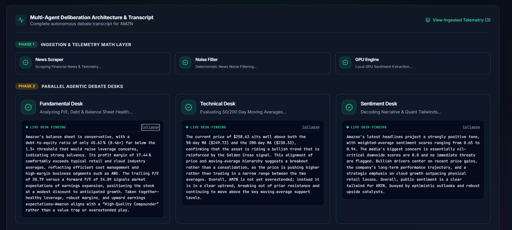
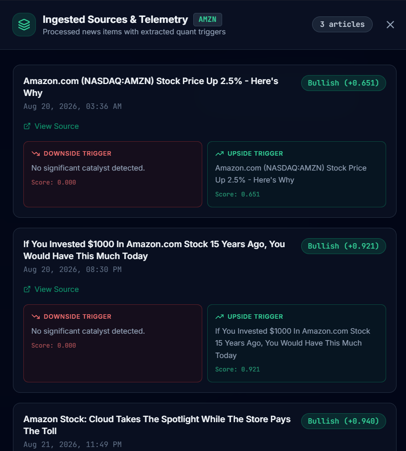
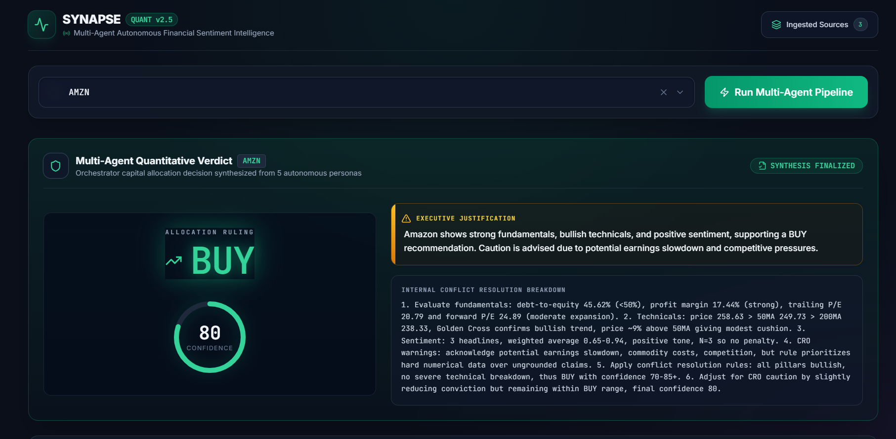
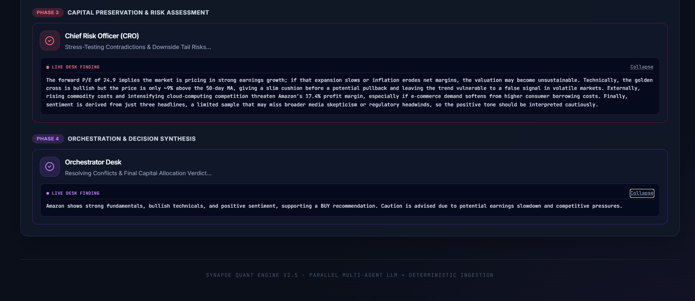

# Financial Sentience Model

An AI-driven, orchestrated pipeline for scraping, filtering, and analyzing financial sentiment in real-time. 

## 🏗 Architecture & Workflow


## 💻 Tech Stack
* **Backend & AI:** Python, Fine-tuned Financial LLM (HuggingFace)
* **Frontend Dashboard:** React, TypeScript, Vite, Tailwind CSS 
* **Pipeline Management:** Custom Python Orchestrator (`orchestrator.py`) 

## ✨ Key Features
* **Automated Data Pipeline:** Dedicated agents for scraping (`scraper.py`) and filtering (`filter_agent.py`) noisy financial data. 
* **Intelligent Aggregation:** Compiles diverse data streams into cohesive analytical contexts (`aggregator.py`). 
* **Custom Financial LLM:** Utilizes a locally fine-tuned tokenizer and model for highly accurate financial sentiment scoring. 
* **Real-Time Visualization:** Interactive React dashboard featuring confidence rings, reasoning accordions, and verdict boards. 

## 📊 Dashboard Preview
<div align="center">
  <table border="0">
    <tr>
      <td></td>
      <td></td>
    </tr>
    <tr>
      <td></td>
      <td></td>
    </tr>
  </table>
</div>

## 📋 Prerequisites
Make sure you have the following installed:
* Python 3.9+
* Node.js v18+ 
* (Optional) HuggingFace account/token if pulling the model remotely

## 🚀 Quick Start

### 1. Backend Setup
Navigate to the backend directory, install dependencies, and start the orchestrator:
```bash
cd backend
..\venv\Scripts\Activate.ps1
pip install -r requirements.txt
python app.py


### 2. Frontend Setup
```bash
cd frontend
npm install
npm run dev
```
