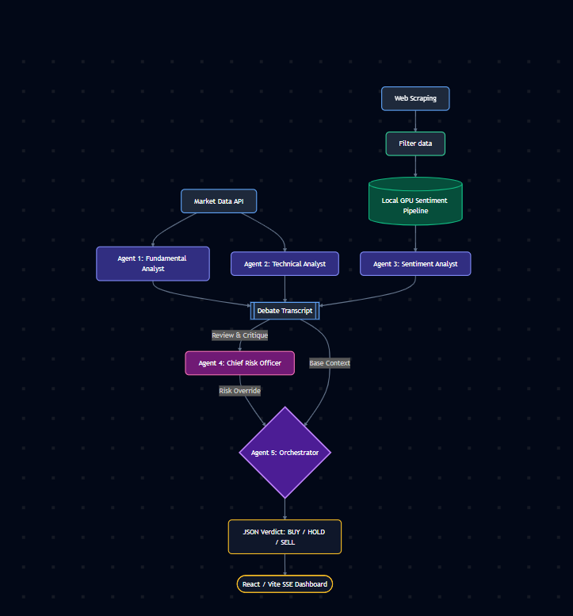

# Financial Sentience Model

An AI-driven, orchestrated pipeline for scraping, filtering, and analyzing financial sentiment in real-time. 

## 🏗 Architecture & Workflow


## 💻 Tech Stack
* **Backend & AI:** Python, Fine-tuned Financial LLM (HuggingFace)
* **Frontend Dashboard:** React, TypeScript, Vite, Tailwind CSS 
* **Pipeline Management:** Custom Python Orchestrator (`orchestrator.py`) 

## ✨ Key Features
* **Automated Data Pipeline:** Dedicated agents for scraping (`scraper.py`) and filtering (`filter_agent.py`) noisy financial data. 
* **Intelligent Aggregation:** Compiles diverse data streams into cohesive analytical contexts (`aggregator.py`). 
* **Custom Financial LLM:** Utilizes a locally fine-tuned tokenizer and model for highly accurate financial sentiment scoring. 
* **Real-Time Visualization:** Interactive React dashboard featuring confidence rings, reasoning accordions, and verdict boards. 

*(Optional: Insert a screenshot of your dashboard here)*
<!--  -->

## 📋 Prerequisites
Make sure you have the following installed:
* Python 3.9+
* Node.js v18+ 
* (Optional) HuggingFace account/token if pulling the model remotely

## 🚀 Quick Start

### 1. Backend Setup
Navigate to the backend directory, install dependencies, and start the orchestrator:
```bash
pip install -r fin_sentience_model/requirements.txt
# Add your environment variables (e.g., API keys) to a .env file here
python fin_sentience_model/orchestrator.py
```

### 2. Frontend Setup
```bash
cd fin_sentience_model/dashboard
npm install
npm run dev
```
